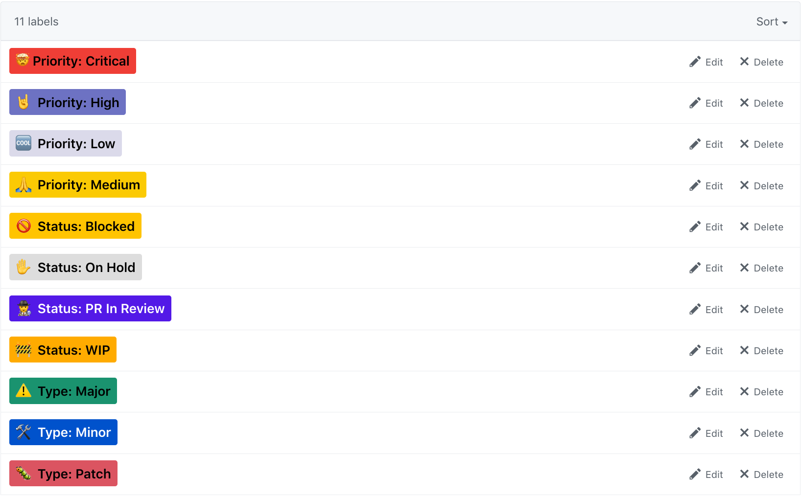

# git-labels [](https://travis-ci.org/bukinoshita/git-labels)

> Creating Github issue labels

## Install

```bash
$ yarn add git-labels
```

## Usage

```js
const gitLabels = require('git-labels')

const project = 'bukinoshita/git-labels'
const labels = [{ name: 'bug', color: 'cb2431' }]
const token = $token

await gitLabels({ project, labels, token })
// => Done!
```

## Why

I've been using Github issues labels a lot these days, but I never liked the default ones. So every project I have to **manually** `delete/create/update` my issues labels with the colors and names I want. This can be done with a single command using this module.

<table>
  <tr>
		<th width="50%">
			Before
		</th>
		<th width="50%">
			After
		</th>
	</tr>
	<tr><!-- Prevent zebra stripes --></tr>
	<tr>
		<td>
			
		</td>
		<td>
			
		</td>
	</tr>
</table>

<p align="center">labels <i>names</i> and <i>colors</i> are customizable.</p>

## API

### gitLabels({ project, labels, token })

#### project

Type: `string`<br />
Format: `org/repo`<br />
Required

Github project.

#### labels

Type: `array`<br />
Format: `[ { name: NAME, color: COLOR }, ... ]`<br />
Default: [`labels.json`](https://github.com/bukinoshita/git-labels/tree/master/utils/labels.json)

Labels to be created

#### token

Type: `string`<br />
Required

[Github access token](https://help.github.com/articles/creating-a-personal-access-token-for-the-command-line/)

## Related

- [git-labels-cli](https://github.com/bukinoshita/git-labels-cli) — CLI for this module

## License

MIT © [Bu Kinoshita](https://bukinoshita.io)
